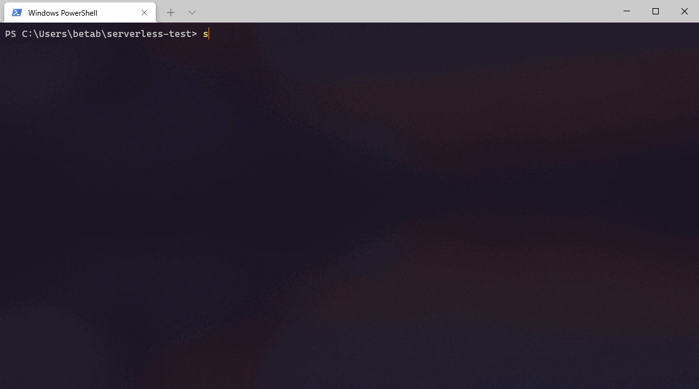

# sls-fgen

Function generator for serverless framework that updates yaml file.



## Installation

```
npm install -g sls-fgen
```


## Usage

Requires pre-existing serverless.yml file.


`➜ sls-fgen --yamlPath=./serverless.yml`

OR

`➜ sls-fgen -y ./serverless.yml`


| Argument    | Flag        | Description |
| ----------- | ----------- | ----------- |
| language    | l           | Abbreviation of programming the language                          |
| template    | t           | Template that function will be generated |
| funcName    | n           | Name of the function that is going to be written to yaml file |
| funcPath    | p           | File name and function name |
| method      | m           | HTTP method |
| httpPath    | h           | HTTP path |
| yamlPath    | y           | Path of the yaml file |


You can also generate with defaults. You won't be asked for missing options.

```
➜ sls-fgen --skip

➜ sls-fgen -s

➜ sls-fgen -s -m put -h user/delete
```


### language


``` 
➜ sls-fgen --language=js

➜ sls-fgen -l js
``` 

#### Available languages by default

| Language    | Abbreviation (folder name)|
| ----------- | ----------- |
| JavaScript  | js          |
| TypeScript  | ts          |

[See](#Customize) how to customize.

### template 

```
➜ sls-fgen --template=default

➜ sls-fgen -t default
```

[See](#Customize) how to customize.

### funcName 

Name carefully. If function name already exists in yaml file your function will be overwritten.

```
➜ sls-fgen --funcName=hello

➜ sls-fgen -n hello
```

### funcPath

File path + name of the function that is going to be written to the file.

```
➜ sls-fgen --funcPath=handler.hello

➜ sls-fgen -p handler.hello
```

If our language is JavaScript, CLI is going to create handler.js file within a function named hello.

You can also specify a folder. This tool cannot create folder. So the folder you are passing should already be existing.

`➜ sls-fgen --funcPath=someFolder/handler.hello`


### method 

```
➜ sls-fgen --method=get

➜ sls-fgen -m get
```

| Available methods |
| ----------------- | 
| post 				|
| get  				|
| put  				|
| patch 			|
| delete 			|


### httpPath 

```
➜ sls-fgen --httpPath=user

➜ sls-fgen -h user
```

### yamlPath 

```
➜ sls-fgen --yamlPath=serverless.yml

➜ sls-fgen -y serverless.yml
```

## Customize

Open template file related to language or edit defaults. 

| Language    | Folder      |
| ----------- | ----------- |
| JavaScript  | js          |
| TypeScript  | ts          |

You can open template files with these commands. **Visual Studio Code** must be installed for this operation.

```
➜ sls-fgen --edit=defaults

➜ sls-fgen --edit=js

➜ sls-fgen -e js
```


```
const templates = {
  default: (name) => {
    return `module.exports.${name} = async (event) => {}`;
  },

  otherTemplate: (name) => {
    return `module.exports.${name} = async (event) => {}`;
  },
};

```

You can also add new languages by creating it's folder and editing [index.js](https://github.com/berabulut/sls-fgen/blob/main/templates/index.js) file. Checkout [templates](https://github.com/berabulut/sls-fgen/blob/main/templates) folder.

